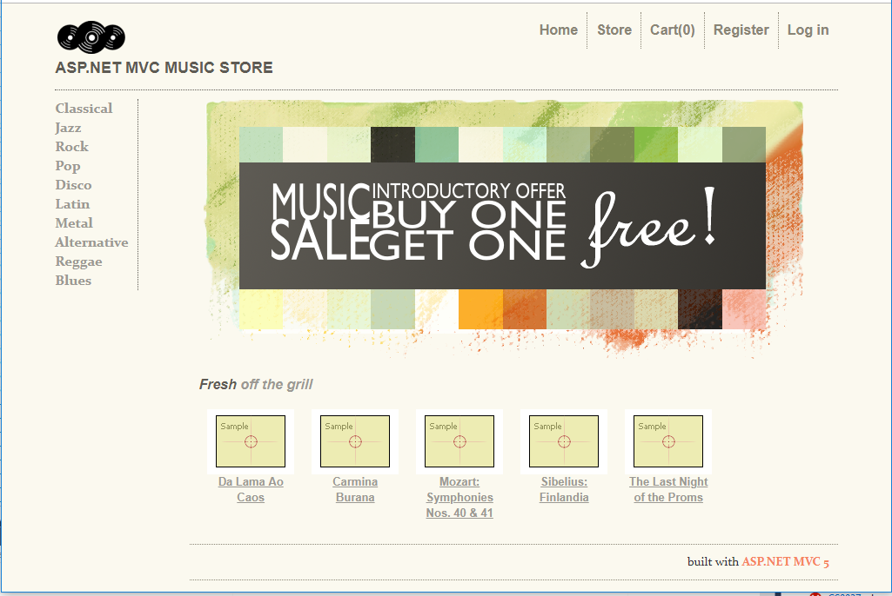

# MvcMusicStore-Tutorial
The Microsoft ASP.NET MVC Music Store Tutorial is a well known sample ASP.NET MVC project that can be found at:

https://docs.microsoft.com/en-us/aspnet/mvc/overview/older-versions/mvc-music-store/

However, this tutorial was written in 2011 using MVC 3 and a lot has changed since then.

As an excercise to learn about MVC, I decided to try my hand at coding this tutorial using Visual Studio 2017 and ASP.NET 4.6.1, MVC version 5.2.4.0.

Notes:

1. In Part 1, when initially creating the project, "Individual User Accounts" Authentication was selected so the scaffolding included the basic functionality for registering an account and loggging in (needed for part 7).

1. In Part 4 of the Tutorial, the DbContext should be include `public DbSet<Artist> Artists {get; set'}`, or you won't be able to create the StoreManagerController

1. In Part 7, several modifications had to be made since MVC 5 uses ASP.NET Identity. To add support for user roles, I followed the tutorial [How to create and assign roles in asp.net mvc 5](https://gooroo.io/GoorooTHINK/Article/17736/How-to-create-and-assign-roles-in-aspnet-mvc-5/32014#.XTTDZ-hKhhF) by Tasmeer Munir. Please note that "ASP.NET Configuration site" instructions seen in older versions of the MVC Music Store tutorial do not apply to ASP.NET Identity.

1. In Part 8, while trying to create the Shopping Cart Index page using "Add View", I initially got the error "Entity Type 'ShoppingCartViewModel' has no key defined. Define the key for this Entity type." This was resolved by entering a blank value for the "Data Context Class" when creating this view (and all subsequent views). I also had to change the version of the jquery from `jquery-1.4.4.min.js` to `jquery-3.3.1.min.js` in the `ShoppingCart\Index.cshtml` file.

1. In Part 9, the ASP.NET Identity login uses email, not name. so the correct statement is `MigrateShoppingCart(model.Email);`

1. Eventually had to incorporated tutorial site.css and the tutorial navbar design to get everything to look right.

1. After getting everything running like the tutorial, there were a couple of small things that I fixed (such as a broken link). I also added the register/login options back to the navbar, because there was no way to logout. Also, I made the "Admin" link only visible to Administrators.

**All in all this was a very fun project to code and I learned quite a bit about ASP.NET MVC from doing it!!!**

Special thanks to Microsoft for making such a detailed tutorial available and to Tasmeer Munir for his excellent tutorial [How to create and assign roles in asp.net mvc 5](https://gooroo.io/GoorooTHINK/Article/17736/How-to-create-and-assign-roles-in-aspnet-mvc-5/32014#.XTTDZ-hKhhF)

